# Hi everyone 👋🌵

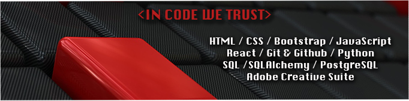

> I'm Pedro Maldonado, a Fullstack web developer, mainly in love with Frontend development.

- Open to work
- 👨‍💻 I'm currently working freelance as a video editor
- If you want to contact me: <a href="https://www.linkedin.com/in/pedro-maldonado-tremont-362074106/"> Linkedin</a>
- 📍 Based in Venezuela 
 
### ***I love challenges, so if you have one, please don't doubt to contact me ❤***

 

#### TECH STACK

|  HTML  |  CSS  |  Bootstrap  |  JavaScript  |  React  |  Python  |  Git  |  REST API  |  SQL |  SQL Alchemy | PostgreSQL  |
|:---:|:---:|:---:|:---:|:---:|:---:|:---:|:---:|:---:|:---:|:---:|
|  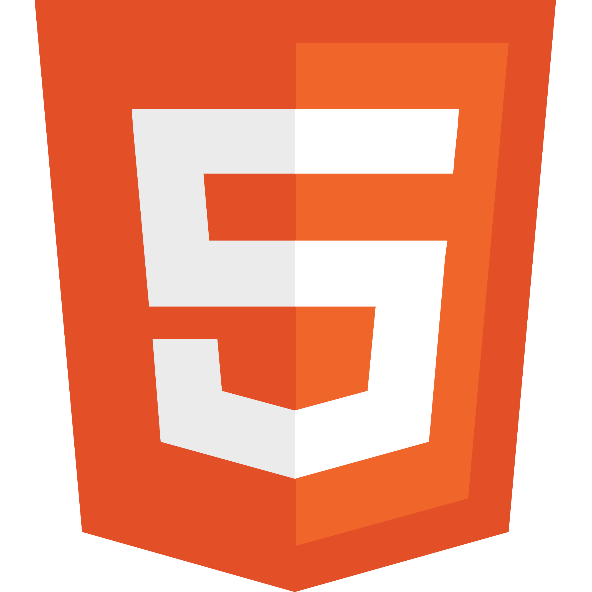 | 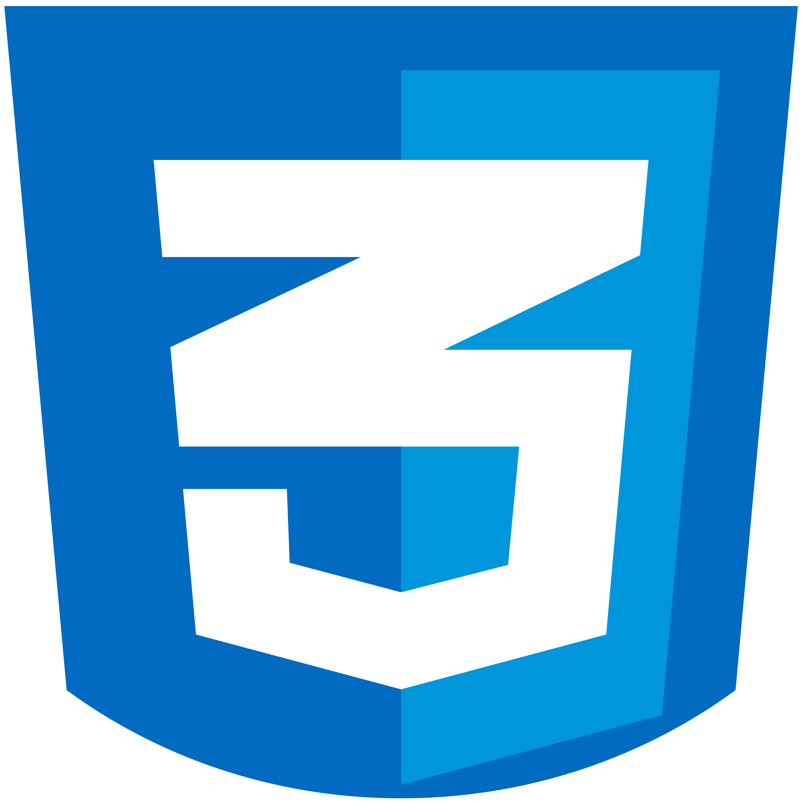  |  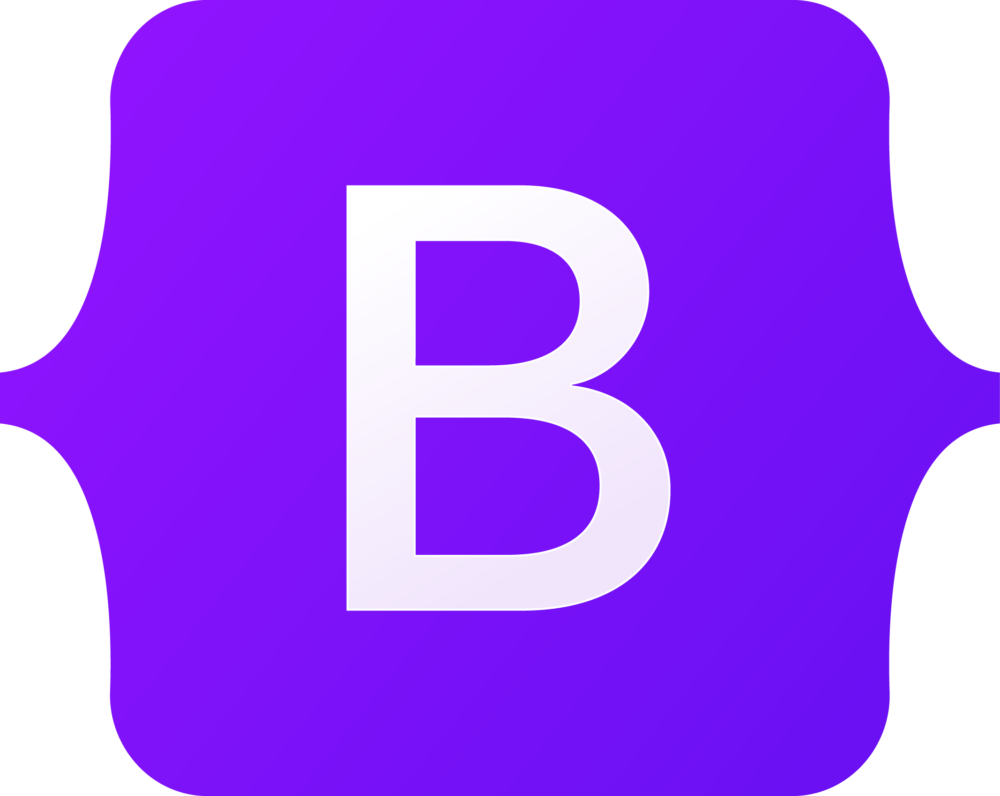  |  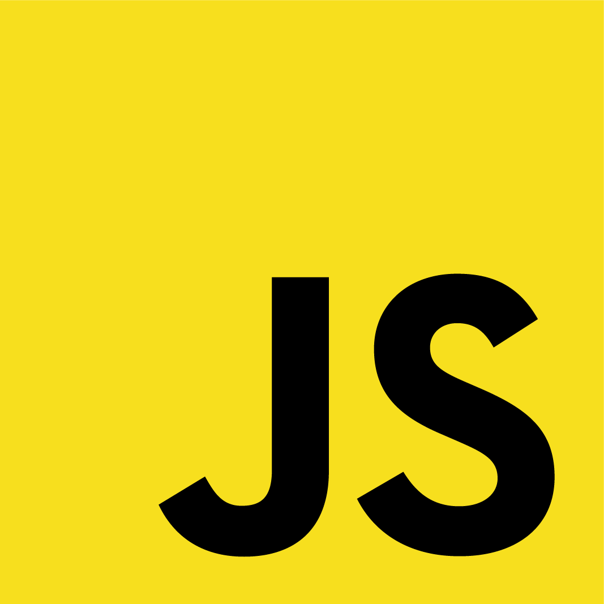  |  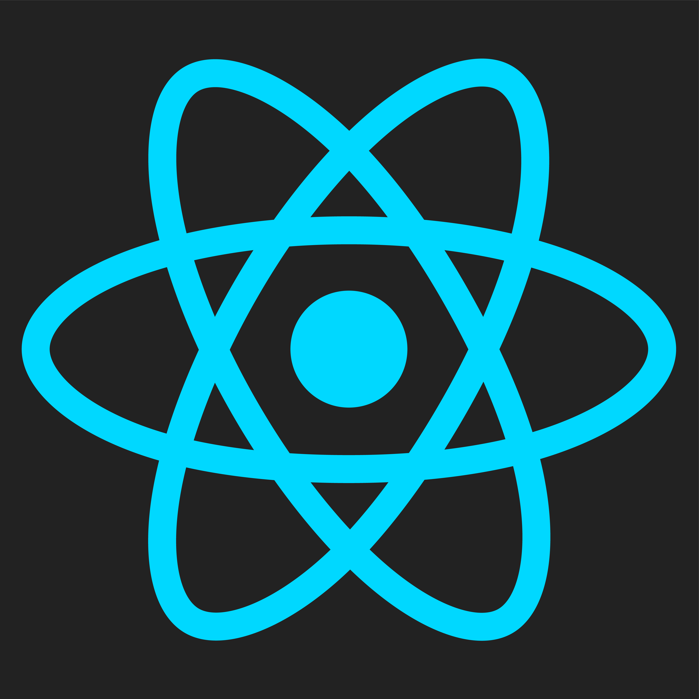 |   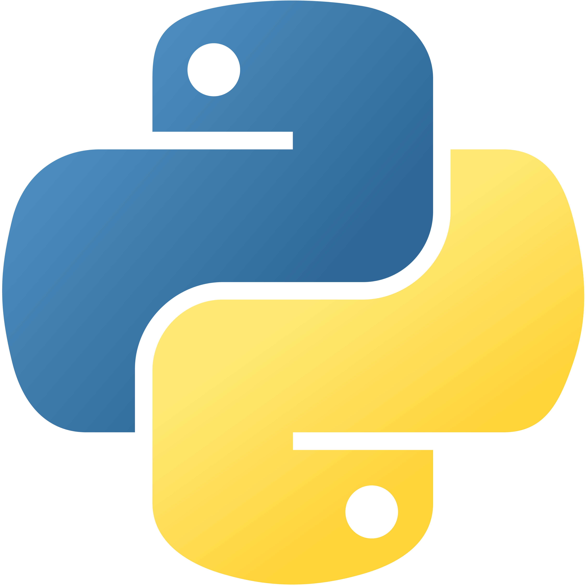  |  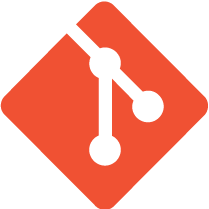  | 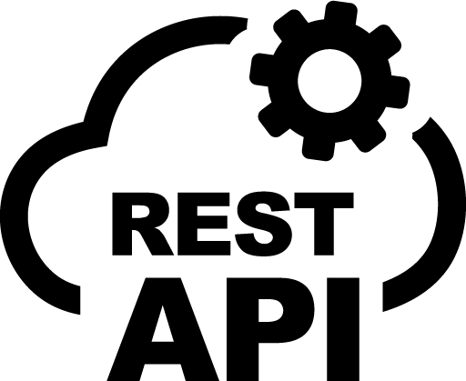  |   |  |   |
 

#### OTHER TOOLS

|  VS Code  | AI | PS | PR | AE |
|:---:|:---:|:---:|:---:|:---:|
|  |   |  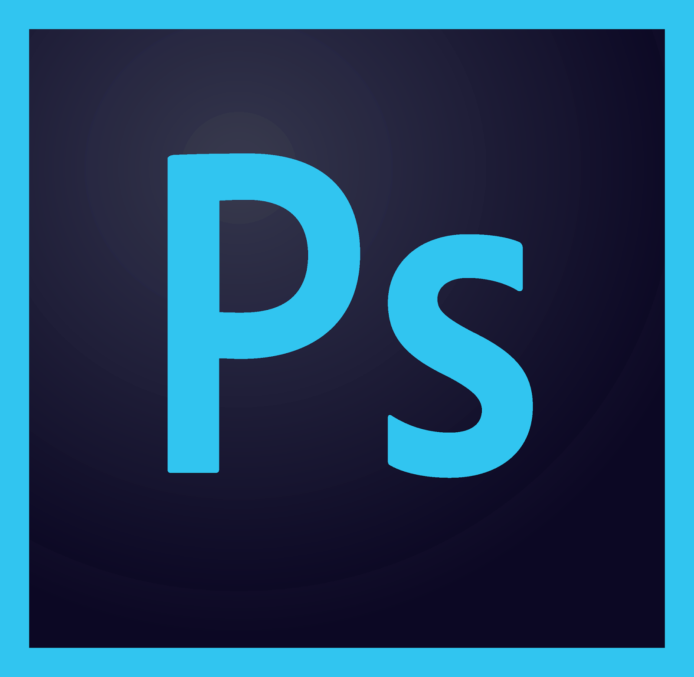  |  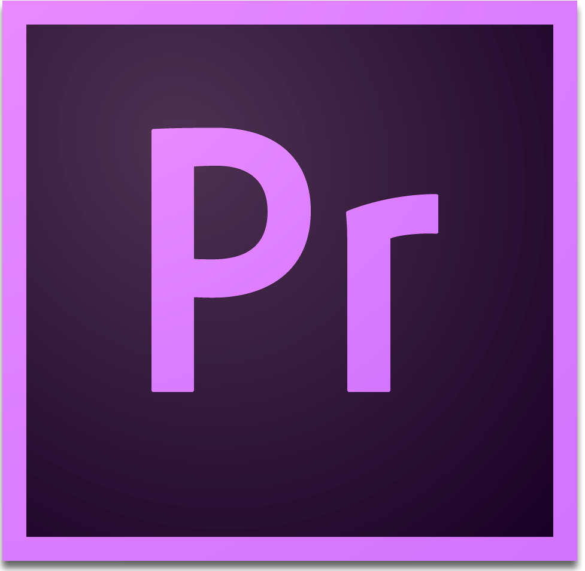  |    |
 

#### MOTTO

### ***In Code We Trust!***<U+1F4BB>

